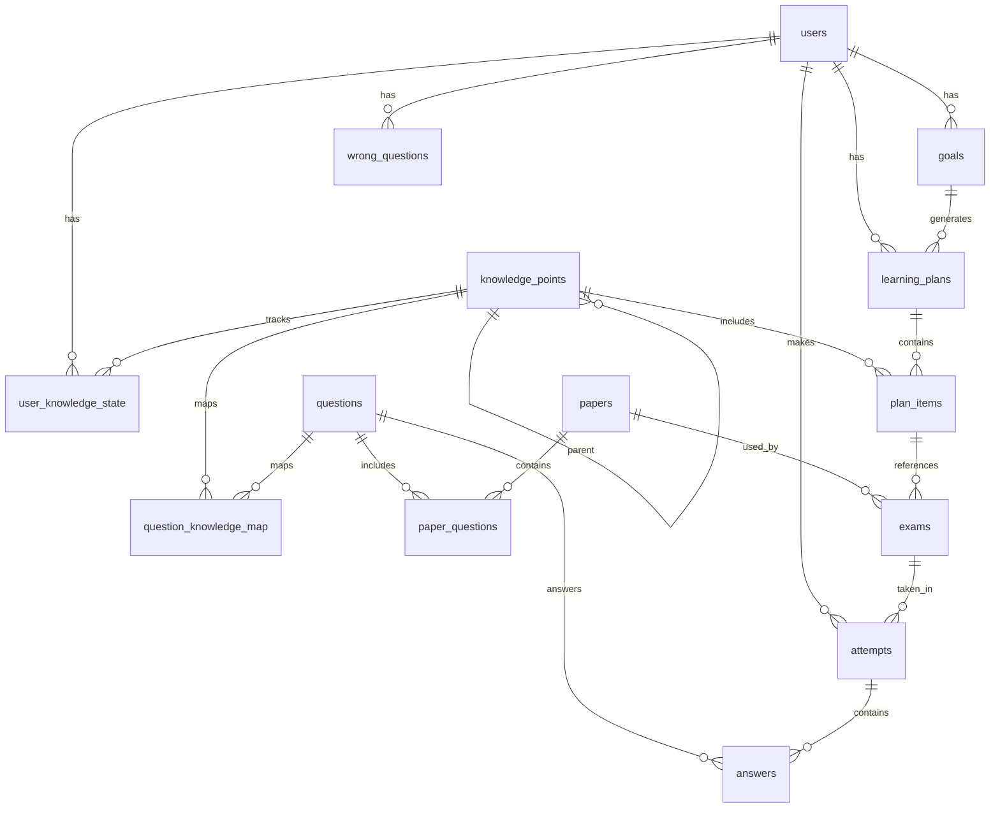

# 数据库设计文档

## 概述

本系统使用 MySQL 8.0 作为主要数据库，采用关系型数据库设计。

## 数据库模式

## 表结构详情

### users - 用户表

| 字段名 | 类型 | 约束 | 说明 |
|--------|------|------|------|
| id | INT | PK, AUTO_INCREMENT | 用户ID |
| username | VARCHAR(50) | UNIQUE, NOT NULL | 用户名 |
| password_hash | VARCHAR(255) | NOT NULL | 密码哈希 |
| role | ENUM('STUDENT','ADMIN') | NOT NULL, DEFAULT 'STUDENT' | 用户角色 |
| is_active | BOOLEAN | NOT NULL, DEFAULT TRUE | 是否激活 |
| created_at | DATETIME | NOT NULL, DEFAULT CURRENT_TIMESTAMP | 创建时间 |
| updated_at | DATETIME | NOT NULL, DEFAULT CURRENT_TIMESTAMP ON UPDATE CURRENT_TIMESTAMP | 更新时间 |

**索引:**
- PRIMARY KEY (id)
- UNIQUE KEY (username)
- INDEX (role, is_active)

### knowledge_points - 知识点表

| 字段名 | 类型 | 约束 | 说明 |
|--------|------|------|------|
| id | INT | PK, AUTO_INCREMENT | 知识点ID |
| parent_id | INT | FK(knowledge_points.id), NULL | 父知识点ID |
| name | VARCHAR(100) | NOT NULL | 知识点名称 |
| code | VARCHAR(50) | UNIQUE, NULL | 知识点编码 |
| weight | DECIMAL(3,2) | NOT NULL, DEFAULT 1.00 | 权重(0.00-1.00) |
| estimated_minutes | INT | NOT NULL, DEFAULT 30 | 预计学习分钟数 |
| created_at | DATETIME | NOT NULL, DEFAULT CURRENT_TIMESTAMP | 创建时间 |
| updated_at | DATETIME | NOT NULL, DEFAULT CURRENT_TIMESTAMP ON UPDATE CURRENT_TIMESTAMP | 更新时间 |

**索引:**
- PRIMARY KEY (id)
- UNIQUE KEY (code)
- INDEX (parent_id)
- INDEX (weight)

### questions - 题目表

| 字段名 | 类型 | 约束 | 说明 |
|--------|------|------|------|
| id | INT | PK, AUTO_INCREMENT | 题目ID |
| type | ENUM('SINGLE','MULTI','JUDGE','FILL','SHORT') | NOT NULL | 题型 |
| stem | TEXT | NOT NULL | 题干 |
| options_json | JSON | NULL | 选项(JSON数组) |
| answer_json | JSON | NOT NULL | 答案(JSON数组) |
| analysis | TEXT | NULL | 解析 |
| difficulty | INT | NOT NULL, CHECK(1<=difficulty<=5) | 难度(1-5) |
| created_at | DATETIME | NOT NULL, DEFAULT CURRENT_TIMESTAMP | 创建时间 |
| updated_at | DATETIME | NOT NULL, DEFAULT CURRENT_TIMESTAMP ON UPDATE CURRENT_TIMESTAMP | 更新时间 |

**索引:**
- PRIMARY KEY (id)
- INDEX (type, difficulty)
- INDEX (created_at)

### question_knowledge_map - 题目知识点映射表

| 字段名 | 类型 | 约束 | 说明 |
|--------|------|------|------|
| question_id | INT | PK, FK(questions.id) | 题目ID |
| knowledge_id | INT | PK, FK(knowledge_points.id) | 知识点ID |

**索引:**
- PRIMARY KEY (question_id, knowledge_id)
- INDEX (knowledge_id)

### papers - 试卷表

| 字段名 | 类型 | 约束 | 说明 |
|--------|------|------|------|
| id | INT | PK, AUTO_INCREMENT | 试卷ID |
| title | VARCHAR(200) | NOT NULL | 试卷标题 |
| mode | ENUM('MANUAL','AUTO') | NOT NULL, DEFAULT 'AUTO' | 组卷模式 |
| config_json | JSON | NULL | 自动组卷配置 |
| total_score | DECIMAL(5,1) | NOT NULL, DEFAULT 100.0 | 总分 |
| created_by | INT | FK(users.id), NOT NULL | 创建者ID |
| created_at | DATETIME | NOT NULL, DEFAULT CURRENT_TIMESTAMP | 创建时间 |
| updated_at | DATETIME | NOT NULL, DEFAULT CURRENT_TIMESTAMP ON UPDATE CURRENT_TIMESTAMP | 更新时间 |

**索引:**
- PRIMARY KEY (id)
- INDEX (created_by)
- INDEX (created_at)

### paper_questions - 试卷题目表

| 字段名 | 类型 | 约束 | 说明 |
|--------|------|------|------|
| id | INT | PK, AUTO_INCREMENT | ID |
| paper_id | INT | FK(papers.id), NOT NULL | 试卷ID |
| question_id | INT | FK(questions.id), NOT NULL | 题目ID |
| order_no | INT | NOT NULL | 题目顺序 |
| score | DECIMAL(4,1) | NOT NULL, DEFAULT 2.0 | 分值 |

**索引:**
- PRIMARY KEY (id)
- UNIQUE KEY (paper_id, order_no)
- INDEX (question_id)

### exams - 考试表

| 字段名 | 类型 | 约束 | 说明 |
|--------|------|------|------|
| id | INT | PK, AUTO_INCREMENT | 考试ID |
| paper_id | INT | FK(papers.id), NOT NULL | 试卷ID |
| title | VARCHAR(200) | NOT NULL | 考试标题 |
| category | ENUM('DIAGNOSTIC','PRACTICE','MOCK') | NOT NULL | 考试类别 |
| duration_minutes | INT | NOT NULL | 考试时长(分钟) |
| status | ENUM('DRAFT','PUBLISHED','ARCHIVED') | NOT NULL, DEFAULT 'DRAFT' | 状态 |
| start_time | DATETIME | NULL | 开始时间 |
| end_time | DATETIME | NULL | 结束时间 |
| created_by | INT | FK(users.id), NOT NULL | 创建者ID |
| created_at | DATETIME | NOT NULL, DEFAULT CURRENT_TIMESTAMP | 创建时间 |
| updated_at | DATETIME | NOT NULL, DEFAULT CURRENT_TIMESTAMP ON UPDATE CURRENT_TIMESTAMP | 更新时间 |

**索引:**
- PRIMARY KEY (id)
- INDEX (category, status)
- INDEX (created_by)

### attempts - 作答记录表

| 字段名 | 类型 | 约束 | 说明 |
|--------|------|------|------|
| id | INT | PK, AUTO_INCREMENT | 作答ID |
| exam_id | INT | FK(exams.id), NOT NULL | 考试ID |
| user_id | INT | FK(users.id), NOT NULL | 用户ID |
| started_at | DATETIME | NOT NULL | 开始时间 |
| submitted_at | DATETIME | NULL | 提交时间 |
| total_score | DECIMAL(5,1) | NULL | 总得分 |
| status | ENUM('DOING','SUBMITTED') | NOT NULL, DEFAULT 'DOING' | 状态 |
| created_at | DATETIME | NOT NULL, DEFAULT CURRENT_TIMESTAMP | 创建时间 |

**索引:**
- PRIMARY KEY (id)
- INDEX (exam_id, user_id)
- INDEX (user_id, status)
- INDEX (started_at)

### answers - 答案表

| 字段名 | 类型 | 约束 | 说明 |
|--------|------|------|------|
| id | INT | PK, AUTO_INCREMENT | 答案ID |
| attempt_id | INT | FK(attempts.id), NOT NULL | 作答ID |
| question_id | INT | FK(questions.id), NOT NULL | 题目ID |
| answer_json | JSON | NOT NULL | 用户答案 |
| is_correct | BOOLEAN | NULL | 是否正确 |
| score_awarded | DECIMAL(4,1) | NULL | 得分 |
| time_spent_seconds | INT | NOT NULL, DEFAULT 0 | 答题用时(秒) |
| created_at | DATETIME | NOT NULL, DEFAULT CURRENT_TIMESTAMP | 创建时间 |

**索引:**
- PRIMARY KEY (id)
- INDEX (attempt_id)
- INDEX (question_id)

### wrong_questions - 错题表

| 字段名 | 类型 | 约束 | 说明 |
|--------|------|------|------|
| id | INT | PK, AUTO_INCREMENT | ID |
| user_id | INT | FK(users.id), NOT NULL | 用户ID |
| question_id | INT | FK(questions.id), NOT NULL | 题目ID |
| wrong_count | INT | NOT NULL, DEFAULT 1 | 错误次数 |
| last_wrong_at | DATETIME | NOT NULL | 最后错题时间 |
| next_review_at | DATETIME | NULL | 下次复习时间 |
| created_at | DATETIME | NOT NULL, DEFAULT CURRENT_TIMESTAMP | 创建时间 |
| updated_at | DATETIME | NOT NULL, DEFAULT CURRENT_TIMESTAMP ON UPDATE CURRENT_TIMESTAMP | 更新时间 |

**索引:**
- PRIMARY KEY (id)
- UNIQUE KEY (user_id, question_id)
- INDEX (user_id, next_review_at)

### user_knowledge_state - 用户知识点掌握状态表

| 字段名 | 类型 | 约束 | 说明 |
|--------|------|------|------|
| id | INT | PK, AUTO_INCREMENT | ID |
| user_id | INT | FK(users.id), NOT NULL | 用户ID |
| knowledge_id | INT | FK(knowledge_points.id), NOT NULL | 知识点ID |
| mastery | DECIMAL(3,2) | NOT NULL, DEFAULT 0.00 | 掌握度(0.00-1.00) |
| ability | DECIMAL(5,2) | NULL | 能力值 |
| updated_at | DATETIME | NOT NULL, DEFAULT CURRENT_TIMESTAMP ON UPDATE CURRENT_TIMESTAMP | 更新时间 |

**索引:**
- PRIMARY KEY (id)
- UNIQUE KEY (user_id, knowledge_id)
- INDEX (user_id, mastery)

### goals - 目标表

| 字段名 | 类型 | 约束 | 说明 |
|--------|------|------|------|
| id | INT | PK, AUTO_INCREMENT | 目标ID |
| user_id | INT | FK(users.id), NOT NULL | 用户ID |
| exam_date | DATE | NOT NULL | 考试日期 |
| target_score | DECIMAL(5,1) | NULL | 目标分数 |
| daily_minutes | INT | NOT NULL, DEFAULT 60 | 每日学习分钟数 |
| created_at | DATETIME | NOT NULL, DEFAULT CURRENT_TIMESTAMP | 创建时间 |
| updated_at | DATETIME | NOT NULL, DEFAULT CURRENT_TIMESTAMP ON UPDATE CURRENT_TIMESTAMP | 更新时间 |

**索引:**
- PRIMARY KEY (id)
- INDEX (user_id)
- INDEX (exam_date)

### learning_plans - 学习计划表

| 字段名 | 类型 | 约束 | 说明 |
|--------|------|------|------|
| id | INT | PK, AUTO_INCREMENT | 计划ID |
| user_id | INT | FK(users.id), NOT NULL | 用户ID |
| goal_id | INT | FK(goals.id), NOT NULL | 目标ID |
| start_date | DATE | NOT NULL | 开始日期 |
| end_date | DATE | NOT NULL | 结束日期 |
| strategy_version | VARCHAR(50) | NOT NULL, DEFAULT 'v1.0' | 策略版本 |
| is_active | BOOLEAN | NOT NULL, DEFAULT TRUE | 是否激活 |
| created_at | DATETIME | NOT NULL, DEFAULT CURRENT_TIMESTAMP | 创建时间 |

**索引:**
- PRIMARY KEY (id)
- INDEX (user_id, is_active)
- INDEX (goal_id)

### plan_items - 计划项表

| 字段名 | 类型 | 约束 | 说明 |
|--------|------|------|------|
| id | INT | PK, AUTO_INCREMENT | 计划项ID |
| plan_id | INT | FK(learning_plans.id), NOT NULL | 计划ID |
| date | DATE | NOT NULL | 日期 |
| type | ENUM('LEARN','PRACTICE','REVIEW','MOCK') | NOT NULL | 类型 |
| knowledge_id | INT | FK(knowledge_points.id), NULL | 知识点ID |
| resource_url | VARCHAR(500) | NULL | 资源链接 |
| title | VARCHAR(200) | NULL | 标题 |
| exam_id | INT | FK(exams.id), NULL | 关联考试ID |
| practice_config_json | JSON | NULL | 练习配置 |
| expected_minutes | INT | NOT NULL | 预期分钟数 |
| status | ENUM('TODO','DONE','SKIPPED') | NOT NULL, DEFAULT 'TODO' | 状态 |
| completed_at | DATETIME | NULL | 完成时间 |
| reason_json | JSON | NULL | 推荐理由 |
| created_at | DATETIME | NOT NULL, DEFAULT CURRENT_TIMESTAMP | 创建时间 |
| updated_at | DATETIME | NOT NULL, DEFAULT CURRENT_TIMESTAMP ON UPDATE CURRENT_TIMESTAMP | 更新时间 |

**索引:**
- PRIMARY KEY (id)
- INDEX (plan_id, date)
- INDEX (type, status)
- INDEX (knowledge_id)

## 数据约束和业务规则

### 完整性约束
- 外键约束：所有外键字段都有相应的外键约束
- 检查约束：difficulty ∈ [1,5]，mastery ∈ [0.00,1.00]，weight ∈ [0.00,1.00]
- 非空约束：关键业务字段不允许为空

### 业务规则
- 用户只能有一个活跃的学习目标
- 知识点树不能形成循环引用
- 考试开始后不能修改试卷内容
- 错题复习时间基于遗忘曲线算法计算
- 学习计划项的reason_json必须包含可解释的推荐理由

### 性能优化
- 核心查询字段建立索引
- 大表采用分表策略（如历史答案数据）
- 读写分离部署考虑
